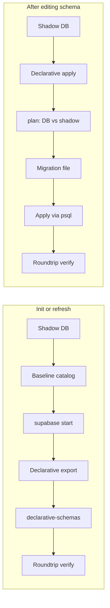

# Declarative schema workflow

This document describes how the dbdev repo uses [pg-delta](https://github.com/supabase/pg-toolbelt/tree/main/packages/pg-delta) for a **declarative schema** workflow: exporting the database shape as version-controlled `.sql` files and generating migrations by diffing desired state against the running database.

## What is declarative schema?

**Declarative schema** means the desired database shape is described in files (under `declarative-schemas/`) rather than only in a linear migration history. pg-delta can:

- **Export** the current database (minus a baseline) into those files.
- **Apply** those files to a temporary “shadow” database.
- **Plan** the diff between the running Supabase DB and the shadow DB to produce a migration script.

So you can edit the declarative files (or re-export after manual DB changes), then run a script to generate a single migration that brings the real database in line with the desired state.

This complements the normal **migration-based** workflow: `supabase/migrations/` remains how changes are applied; the declarative flow is a way to derive a migration from a desired-state snapshot.

## How it fits this repo

dbdev is a Supabase project with many migrations. The declarative flow:

1. Uses a **shadow DB** (same Docker image as Supabase Postgres) so the real DB is not modified until you apply a migration.
2. Keeps desired state in `declarative-schemas/` (exported from the live DB, then editable).
3. Diffs that state against the running Supabase DB and writes a migration under `supabase/migrations/`.
4. You apply the migration with `psql` (or the script can do it), then use Supabase as usual.



## Prerequisites

- **Node.js and npm** – for `npx pgdelta` (run `npm install` in the repo root).
- **Docker** – for the shadow DB and Supabase local stack.
- **Supabase CLI** – for `supabase start` / `supabase stop`.
- **psql** – for applying the generated migration (or use the script’s default apply step).

From the repo root:

```bash
npm install
npx pgdelta --help   # sanity check
```

## Scripts and usage

Both scripts must be run **from the dbdev repo root** so `npx pgdelta` resolves from `node_modules/`.

### 1. Init (one-time or refresh): export declarative schema

Initializes or refreshes `declarative-schemas/` from the running Supabase DB:

1. Starts a shadow DB (Supabase Postgres image on port 6544).
2. Snapshots the clean shadow DB as a baseline catalog.
3. Starts the dbdev Supabase project (if not already running) on port 54322.
4. Exports the declarative schema (diff: baseline → Supabase DB) into `declarative-schemas/`.
5. Verifies roundtrip: applies the export to a fresh shadow DB and diffs against Supabase (expect 0 changes, or minor GRANT ordering differences).

```bash
bash scripts/declarative-dbdev-init.sh
```

Optional env vars:

| Variable | Default | Description |
|----------|---------|-------------|
| `SKIP_SUPABASE_START` | (unset) | Set to skip `supabase start` (e.g. DB already running). |
| `SKIP_VERIFY` | (unset) | Set to skip the roundtrip verification step. |
| `PGDELTA` | `npx pgdelta` | Override the pg-delta CLI command. |
| `SHADOW_IMAGE` | `supabase/postgres:15.6.1.143` | Docker image for the shadow DB. |
| `OUTPUT_DIR` | `./declarative-schemas` | Where to write the exported schema. |
| `BASELINE_SNAPSHOT` | `./baseline-catalog.json` | Path for the baseline catalog (not committed; in `.gitignore`). |

### Changes made in Studio: re-export with init

If you change the database through **Supabase Studio** (or any direct SQL), the declarative schema files will no longer match the running database. To pull those changes back into the repo:

1. Leave the Supabase project running (or start it with the init script).
2. Re-run the init script from the repo root:

   ```bash
   bash scripts/declarative-dbdev-init.sh
   ```

   The export step uses the **`--force`** flag, so existing files under `declarative-schemas/` are overwritten and the directory is updated to match the current database. You get a clean declarative snapshot of whatever is in the DB, including your Studio changes.

3. Commit the updated `declarative-schemas/` so the desired state stays in version control. To also add a migration file that records the Studio changes in `supabase/migrations/`, use the Supabase CLI (e.g. `supabase db diff`) to generate a migration from the current DB state, or run the update script after the re-export if you have further edits to the declarative schema.

You can skip the roundtrip verification when re-exporting after Studio changes by setting `SKIP_VERIFY=1` if the verification step is noisy or fails due to known export limitations.

### 2. Update (after editing schema): generate and apply migration

After you edit files under `declarative-schemas/`:

1. Starts a shadow DB.
2. Applies the declarative schema to the shadow DB (desired state).
3. Runs `pgdelta plan` (source = Supabase DB, target = shadow) to generate a migration.
4. Saves the migration to `supabase/migrations/<timestamp>_<name>.sql`.
5. Applies the migration to the Supabase DB with `psql`.
6. Verifies roundtrip (diff Supabase vs shadow; expect 0 changes).

```bash
MIGRATION_NAME=my_change bash scripts/declarative-dbdev-update.sh
```

Optional env vars:

| Variable | Default | Description |
|----------|---------|-------------|
| `MIGRATION_NAME` | `declarative_update` | Suffix for the migration filename. |
| `SKIP_APPLY` | (unset) | Set to only write the migration file; do not apply it. |
| `SKIP_VERIFY` | (unset) | Set to skip the roundtrip verification step. |
| `PGDELTA` | `npx pgdelta` | Override the pg-delta CLI command. |
| `SHADOW_IMAGE` | `supabase/postgres:15.6.1.143` | Docker image for the shadow DB. |
| `OUTPUT_DIR` | `./declarative-schemas` | Declarative schema directory. |

## File layout

- **`declarative-schemas/`** – Version-controlled desired schema (exported by init, edited by you, applied to shadow in update).
  - **`cluster/`** – Cluster-level objects: extensions (`extensions/`), event triggers (`event_triggers.sql`).
  - **`schemas/`** – Per-schema objects: `app/` (tables, functions, domains, types), `public/` (views, functions).
- **`supabase/migrations/`** – Supabase migration history; generated migrations are written here and applied via `psql` (or the script).
- **`baseline-catalog.json`** – Generated by the init script, used as the “clean” baseline for export; not committed (in `.gitignore`).

## Troubleshooting

- **Shadow image** – The shadow DB must use a `supabase/postgres` image (e.g. `15.6.1.143`) so system schemas (`auth`, `storage`, `extensions`) match. If you use a different Postgres major version, set `SHADOW_IMAGE` to a matching Supabase image tag.
- **Roundtrip fails** – If verification reports changes after a roundtrip, check that extension and domain ordering in the export is correct. Re-running the init script with the current pg-delta can refresh the export; if the tool was recently upgraded, a fresh export may fix serialization issues (e.g. domain base types). The roundtrip may also report **missing RLS policies** (policies that exist in the DB but were not captured in the export) or **GRANT differences** (due to `ALTER DEFAULT PRIVILEGES` ordering). You can skip verification for init with `SKIP_VERIFY=1` and still use the declarative schema for edit-and-migrate workflows.
- **Supabase not running** – The update script requires the Supabase DB on port 54322. Run `supabase start` from the repo root first, or use the init script once to start it.
- **`npx pgdelta` not found** – Run `npm install` from the repo root; the scripts expect to be run from the root so `npx` resolves the local `@supabase/pg-delta` dependency.
