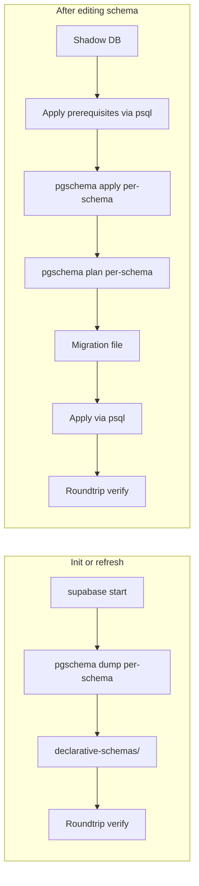

# Declarative schema workflow

This document describes how the dbdev repo uses [pgschema](https://www.pgschema.com/) for a **declarative schema** workflow: dumping the database shape as version-controlled `.sql` files and generating migrations by planning the diff between desired state and the running database.

## What is declarative schema?

**Declarative schema** means the desired database shape is described in files (under `declarative-schemas/`) rather than only in a linear migration history. pgschema can:

- **Dump** the current database schema into multi-file SQL (`pgschema dump`).
- **Apply** those files to a temporary "shadow" database (`pgschema apply`).
- **Plan** the diff between the running Supabase DB and the desired state to produce a migration script (`pgschema plan`).

pgschema operates **per-schema** (e.g. `app`, `public`) and does not manage extensions or schema creation. Those are handled by separate SQL files applied via `psql`.

This complements the normal **migration-based** workflow: `supabase/migrations/` remains how changes are applied; the declarative flow is a way to derive a migration from a desired-state snapshot.

## How it fits this repo

dbdev is a Supabase project with many migrations. The declarative flow:

1. Uses a **shadow DB** (same Docker image as Supabase Postgres) so the real DB is not modified until you apply a migration.
2. Keeps desired state in `declarative-schemas/` (dumped from the live DB, then editable).
3. Plans the diff per-schema against the running Supabase DB and writes a migration under `supabase/migrations/`.
4. You apply the migration with `psql` (or the script can do it), then use Supabase as usual.



## Prerequisites

- **pgschema CLI** – install from [pgschema.com](https://www.pgschema.com/). Verify with `pgschema --help`.
- **Docker** – for the shadow DB and Supabase local stack.
- **Supabase CLI** – for `supabase start` / `supabase stop`.
- **psql** – for applying prerequisites and generated migrations.

## Scripts and usage

Both scripts must be run **from the dbdev repo root**.

### 1. Init (one-time or refresh): dump declarative schema

Initializes or refreshes `declarative-schemas/` from the running Supabase DB:

1. Starts the dbdev Supabase project (if not already running) on port 54322.
2. Dumps each managed schema (`app`, `public`) using `pgschema dump --multi-file`.
3. Optionally verifies roundtrip: applies to a fresh shadow DB and plans against Supabase (expect 0 changes).

```bash
bash scripts/declarative-dbdev-init.sh
```

Optional env vars:

| Variable | Default | Description |
|----------|---------|-------------|
| `SKIP_SUPABASE_START` | (unset) | Set to skip `supabase start` (e.g. DB already running). |
| `SKIP_VERIFY` | (unset) | Set to skip the roundtrip verification step. |
| `PGSCHEMA` | `pgschema` | Override the pgschema CLI command. |
| `SHADOW_IMAGE` | `supabase/postgres:15.8.1.085` | Docker image for the shadow DB. |
| `OUTPUT_DIR` | `./declarative-schemas` | Where to write the dumped schema. |

### Changes made in Studio: re-dump with init

If you change the database through **Supabase Studio** (or any direct SQL), the declarative schema files will no longer match the running database. To pull those changes back into the repo:

1. Leave the Supabase project running (or start it with the init script).
2. Re-run the init script from the repo root:

   ```bash
   bash scripts/declarative-dbdev-init.sh
   ```

   The dump step removes and recreates the per-schema directories, so `declarative-schemas/` is updated to match the current database including your Studio changes.

3. Commit the updated `declarative-schemas/` so the desired state stays in version control.

### 2. Update (after editing schema): generate and apply migration

After you edit files under `declarative-schemas/`:

1. Starts a shadow DB.
2. Applies prerequisites to shadow (`extensions.sql`, `schemas-setup.sql`) via `psql`.
3. Applies declarative schemas to shadow via `pgschema apply` per-schema (desired state).
4. Runs `pgschema plan` per-schema (supabase DB vs desired state) to generate migration SQL.
5. Concatenates per-schema SQL into a single migration under `supabase/migrations/<timestamp>_<name>.sql`.
6. Applies the migration to the Supabase DB with `psql`.
7. Verifies roundtrip (plan per-schema; expect 0 changes).

```bash
MIGRATION_NAME=my_change bash scripts/declarative-dbdev-update.sh
```

Optional env vars:

| Variable | Default | Description |
|----------|---------|-------------|
| `MIGRATION_NAME` | `declarative_update` | Suffix for the migration filename. |
| `SKIP_APPLY` | (unset) | Set to only write the migration file; do not apply it. |
| `SKIP_VERIFY` | (unset) | Set to skip the roundtrip verification step. |
| `PGSCHEMA` | `pgschema` | Override the pgschema CLI command. |
| `SHADOW_IMAGE` | `supabase/postgres:15.8.1.085` | Docker image for the shadow DB. |
| `OUTPUT_DIR` | `./declarative-schemas` | Declarative schema directory. |

## File layout

```
declarative-schemas/
├── extensions.sql          # Manual: CREATE EXTENSION statements (psql)
├── schemas-setup.sql       # Manual: CREATE SCHEMA, ALTER DEFAULT PRIVILEGES, GRANT USAGE (psql)
├── app/                    # pgschema-managed: app schema objects
│   ├── main.sql            # Entry point (\i includes for all objects)
│   ├── tables/
│   ├── functions/
│   ├── domains/
│   ├── types/
│   ├── indexes/
│   └── policies/
└── public/                 # pgschema-managed: public schema objects
    ├── main.sql            # Entry point
    ├── functions/
    ├── views/
    ├── matviews/
    └── ...
```

- **`extensions.sql`** – Manually maintained. pgschema does not manage extensions; apply with `psql` before `pgschema apply`.
- **`schemas-setup.sql`** – Manually maintained. Creates the `app` schema, sets default privileges, and grants. pgschema manages objects within schemas, not the schemas themselves.
- **`app/`, `public/`** – Generated by `pgschema dump --multi-file`. The `main.sql` file is the entry point that includes all object files via `\i` directives. Edit individual files to change the desired state.
- **`supabase/migrations/`** – Supabase migration history; generated migrations are written here and applied via `psql`.

## Ordering constraints

When applying to the shadow DB, order matters due to cross-schema dependencies:

1. **Extensions** (`extensions.sql` via psql) – needed for `extensions.citext`, `extensions.gin_trgm_ops`, etc.
2. **Schema creation** (`schemas-setup.sql` via psql) – creates `app` schema with privileges.
3. **`app` schema** (`pgschema apply --schema app`) – tables, functions, domains, types.
4. **`public` schema** (`pgschema apply --schema public`) – views/functions that reference `app.*`.

## Troubleshooting

- **Shadow image** – The shadow DB must use a `supabase/postgres` image so system schemas (`auth`, `storage`, `extensions`) match. If you use a different Postgres major version, set `SHADOW_IMAGE` to a matching Supabase image tag.
- **Roundtrip fails** – If verification reports changes after a roundtrip, check that the dump captured all objects correctly. Re-running the init script can refresh the dump. The `--plan-host`/`--plan-port` flags point pgschema at the shadow DB so it can resolve cross-schema references (e.g. `extensions.citext`).
- **Supabase not running** – The update script requires the Supabase DB on port 54322. Run `supabase start` from the repo root first, or use the init script once to start it.
- **`pgschema` not found** – Install from [pgschema.com](https://www.pgschema.com/) and ensure it's on your PATH. Verify with `pgschema --help`.
- **Extension references in plan** – pgschema needs a "plan database" to resolve references to objects in other schemas (like `extensions.citext`). The scripts pass `--plan-host`/`--plan-port` pointing to the shadow DB which has extensions installed.
